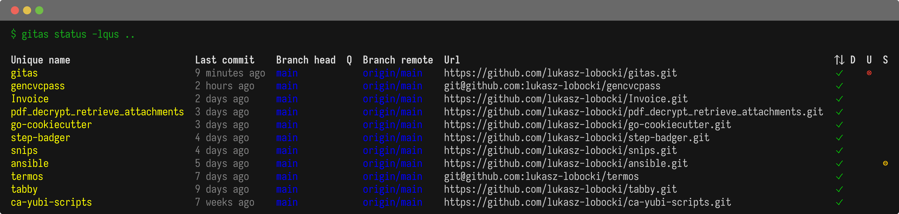

# gitas 

This tool has two features:

- display the **status** of multiple git repos side by side
- delegate **shell** commands on multiple git repos

Unlike [gita](https://github.com/nosarthur/gita), it does not require maintenance of repositiories' list. It works on all repos found recursively in the given path.

## gitas status

Show status of each git repository found in PATH

```bash
gitas status [PATH] [flags]
```

### Examples



```bash
gitas status ~ --name=p -b=true -o=n
gitas status
gitas status /home --time=false
```

See also [markdown](samples/markdown_example.md) and [json](samples/json_example.json) example results.

### Flags

```
  -n, --name {u|p|s}   name shown: unique|path|short (default u)
  -t, --time           time of last commit shown (default true)
  -f, --format {r|i}   format time: relative|iso (default r)
  -b, --branch         branch shown
  -q, --query          query fetch needed (implies -br)
  -r, --remote         remote shown
  -l, --url            url shown
  -d, --dirty          dirty shown (default true)
  -u, --untracked      untracked shown
  -s, --stash          stash shown
  -o, --order {t|n}    order: time|name (default t)
  -e, --emit {t|j|m}   emit format: table|json|markdown (default t)
  -h, --help           help for status
```

### Flags inherited from parent commands

```
      --logging int   logging level [0...3] (default 0)
```

## gitas shell

Execute "command" for each git repository found in PATH

```bash
gitas shell [PATH] "command" [flags]
```

### Examples


```bash
gitas shell /home "ls"
gitas shell ~ "git describe --abbrev=0 --tags"
gitas shell "ls | grep 'P'"
```

### Flags

```
  -h, --help   help for shell
```

### Flags inherited from parent commands

```
      --logging int   logging level [0...3] (default 0)
```

## Build

```bash
goreleaser build --clean
```

## License

`gitas` was created by Lukasz Lobocki. It is licensed under the terms of the CC0 v1.0 Universal license.

Inspired by [gita](https://github.com/nosarthur/gita).

All components used retain their original licenses.

## Credits

`gitas` was created with [cookiecutter](https://cookiecutter.readthedocs.io/en/latest/) and [template](https://github.com/lukasz-lobocki/go-cookiecutter).
